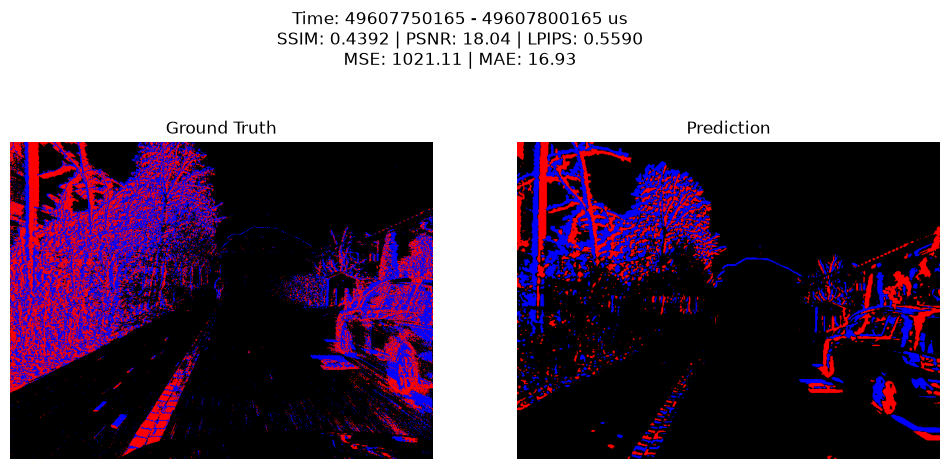
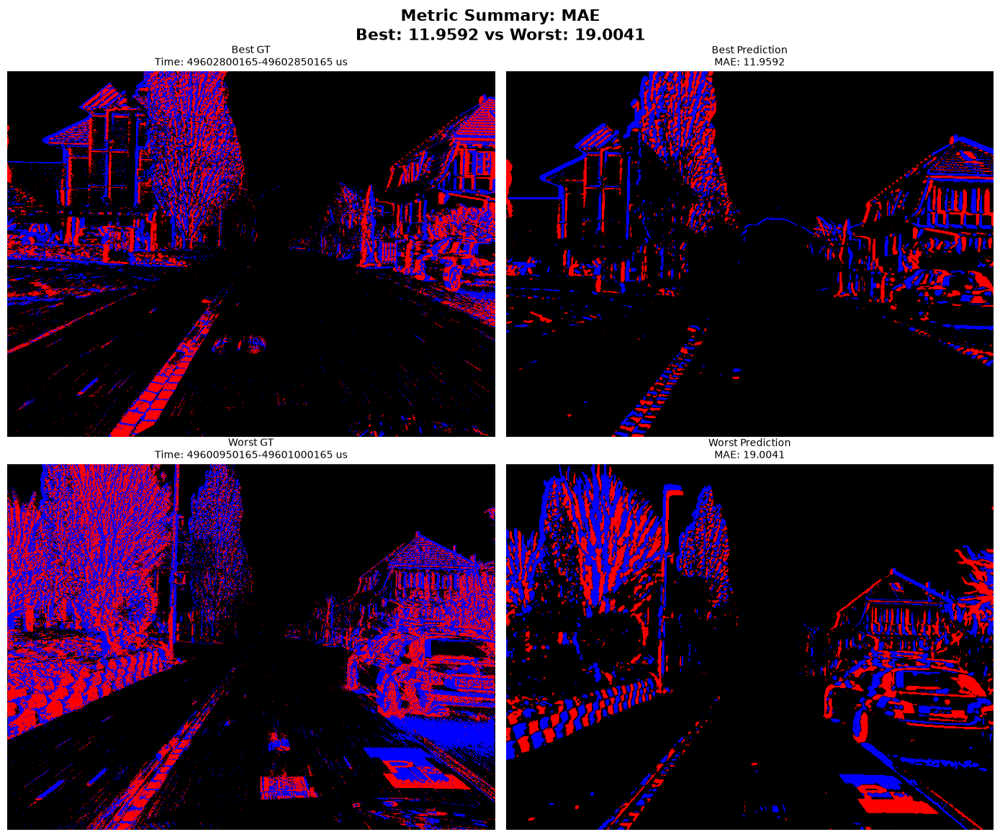
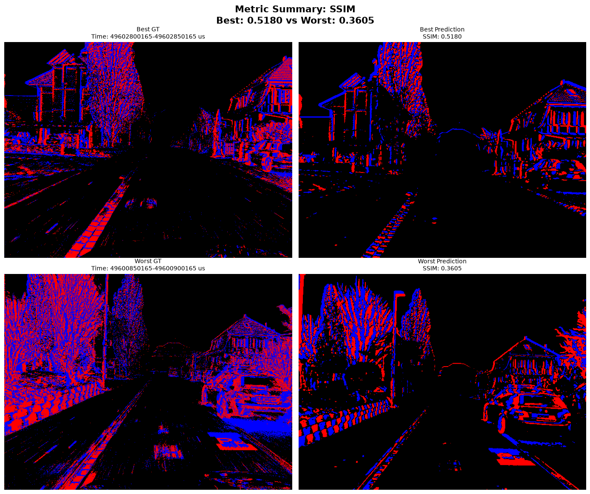
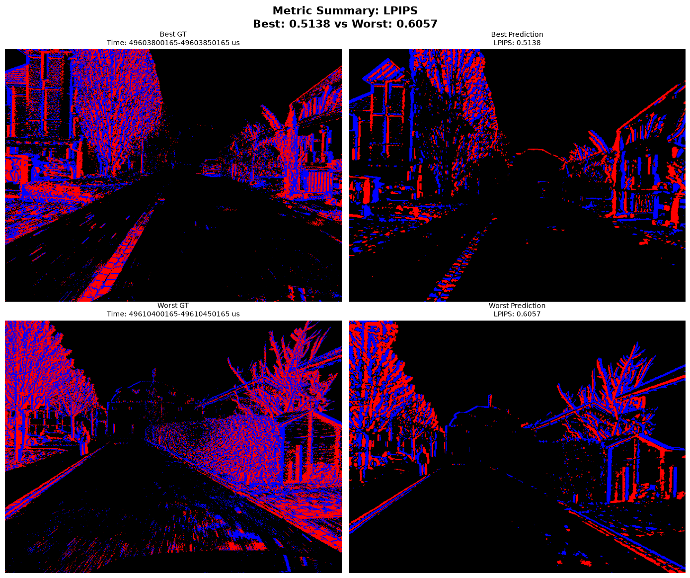
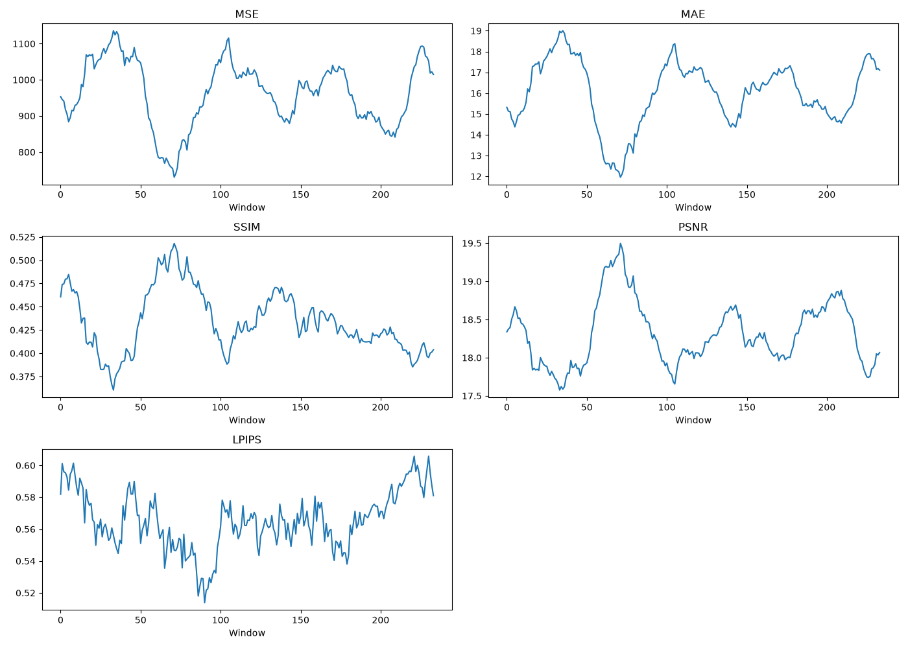
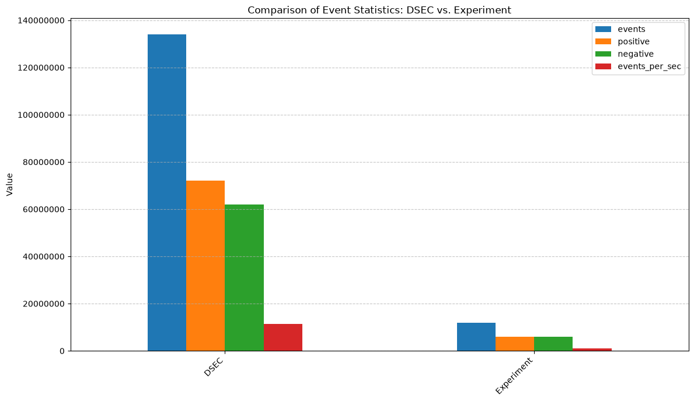

# Frame-to-Event Conversion Framework

**Author:** Zarco Romero, José Antonio  
**Repository:** https://github.com/jzarcoo/Frame-to-Event-Conversion-Framework.git

---

# 1. Background

Spiking Neural Networks (SNNs) perform best when processing sparse, asynchronous events from event cameras (DVS/DAVIS), rather than dense RGB pixels.

However, we face a data limitation: event camera datasets are limited. Traditional RGB video is abundant.

The solution: Convert RGB video sequences into event streams.

This allows SNNs to be trained using existing RGB data. Subsequently, the same trained model can be reused with a real event sensor, resulting in a single model compatible with heterogeneous sensors (RGB + events).

Public datasets such as MVSEC and DSEC provide RGB frames synchronized with real-world events (ground-truth), allowing for direct validation of any conversion framework.

---

# 2. Project Objective

Develop a lightweight, classic framework (not based on deep learning) that converts RGB video into an event stream in the format `(x,y,t,p)`.

## Core Concept

Compare the current frame to the previous one at the pixel level and emit an event where the intensity change exceeds a configurable threshold:

- **Positive polarity (`p = 1`)**: Increase in brightness.
- **Negative polarity (`p = -1`)**: Decrease in brightness.

---

# 3. Project Phases

## Phase 1: Literature Review

Header to document the state of the art and justify the chosen approach.

### ESIM

ESIM simulates event cameras by operating in the log-intensity domain, where an asynchronous event is triggered whenever the per-pixel brightness change exceeds a specified contrast threshold.

To accurately approximate this continuous level-crossing process without resorting to inefficient, fixed high-rate rendering, the framework tightly couples a 3D rendering engine with the event simulator. By evaluating the continuous camera trajectory and generating dense motion fields at each step, the system dynamically predicts the optimal timestamp for the next frame. This allows the simulator to sample heavily during rapid transient states and conserve computational resources when the scene is static.

This adaptive sampling is governed by two core mathematical strategies:

1. The first calculates the maximum expected rate of brightness change using a first-order Taylor expansion of the brightness constancy assumption.
2. A simplified alternative directly bounds the maximum pixel displacement.

To bridge the sim-to-real gap, ESIM incorporates physical sensor non-idealities. It models the contrast threshold as a Gaussian-distributed variable rather than a static value and supports independent, asymmetric thresholds for positive and negative events to faithfully replicate real-world hardware electronic biases.

The experiments in the article demonstrate that the adaptive method based on optical flow reduces simulation time and the number of frames needed to achieve the same level of accuracy (RMSE) as uniform sampling by up to 60%.

### v2e

v2e is a video-to-event conversion framework that generates synthetic DVS events directly from conventional RGB videos.

The pipeline first converts RGB frames into luma images and optionally increases their temporal resolution using Super-SloMo interpolation, producing intermediate frames that better approximate the continuous evolution of the scene.

The resulting intensities are then mapped to the logarithmic domain, since event cameras respond to relative brightness changes rather than absolute intensity values.

Events are generated whenever the accumulated change in log-intensity exceeds a positive or negative contrast threshold, closely mimicking the operation of a real DVS pixel.

To improve realism, v2e incorporates several sensor non-idealities:

- It models the finite bandwidth of photoreceptors through an intensity-dependent low-pass filter.
- It introduces pixel-to-pixel threshold variations using Gaussian-distributed contrast thresholds.
- It simulates hot pixels, leak events, and temporal shot noise through stochastic processes.

Unlike ESIM, which relies on a 3D rendering engine and adaptive rendering strategies, v2e operates directly on recorded video sequences, making it a practical and computationally efficient approach for converting existing image datasets into event-based data.

### Selected Approach

Based on this review, we chose a lightweight classical approach inspired by v2e.

Our goal is not to maximize physical realism, but to provide an efficient RGB-to-event conversion framework that captures the core behavior of event cameras while remaining computationally inexpensive and easy to apply to existing video datasets.

---

## Phase 2: Framework Implementation

Programming Language: Python

Each RGB frame is converted to grayscale.

The processed frame is compared with the last event frame, and pixels whose intensity change exceeds a predefined threshold are marked as events.

If enough pixels have changed, an event stream `(x, y, t, p)` is generated, where:

- `x` and `y` are the pixel coordinates.
- `t` is the timestamp.
- `p` is the polarity indicating whether the intensity increased or decreased.

The reference frame is updated with the detected changes, and the process repeats for the next frame.

The resulting events are rendered and saved as a video for visualization.

---

## Phase 3: Evaluation

To validate the effectiveness of our lightweight RGB-to-event framework, we evaluated the generated synthetic events against the DSEC dataset, which provides synchronized RGB frames and real event-camera recordings.

```bash
uv run python -m framework.evaluation.cli -o test --gt data/thun_00_a/thun_00_a_events_left/events.h5 --pred results/thun_00_a_events.h5
```

The evaluation pipeline compares reconstructed event frames within specific temporal windows of 50 ms (50,000 $\mu$s) across several key metrics.



### 3.1 Evaluation Metrics

Evaluating asynchronous event streams against ground truth requires a combination of traditional pixel-level metrics and perceptual metrics, as event data is inherently sparse and focused on dynamic edges.

* **MSE (Mean Squared Error)**: MSE measures the average squared pixel-wise difference between the generated event image and the ground truth.

  
*  **MAE (Mean Absolute Error)**: MAE measures the average absolute pixel difference.


* **PSNR (Peak Signal-to-Noise Ratio)**: Evaluates the pixel-level fidelity of the reconstructed frame. Higher values indicate less distortion.


* **SSIM (Structural Similarity Index)**: Measures the similarity of structural information between the predicted event frame and the ground truth.


* **LPIPS (Learned Perceptual Image Patch Similarity)**: A crucial metric for our use case. Unlike MSE or SSIM, which heavily penalize pixel misalignments, LPIPS uses deep network features (**AlexNet**) to measure perceptual similarity. Because SNNs rely on structural shapes and moving edges rather than exact pixel-perfect matches, LPIPS is often the most accurate representation of whether the synthetic events "look" and "behave" like real events.


### 3.2 Quantitative Results

Running the evaluator over 237 frames (with 3 skipped due to zero events in the prediction window), we obtained the following best and worst values across 234 valid windows:

```bash
Running in frame-by-frame mode (Interval: 50000 us)

Valid evaluations : 234
Skipped           : 3
--------------------------------------------------
METRIC   | BEST VALUE   | WORST VALUE 
--------------------------------------------------
MSE      | 730.1671     | 1136.0068   
MAE      | 11.9592      | 19.0041     
SSIM     | 0.5180       | 0.3605      
PSNR     | 19.4966      | 17.5770     
LPIPS    | 0.5138       | 0.6057          

```



### 3.3 Event Sparsity Analysis

A critical finding from our evaluation is the overall event yield. The generated synthetic event stream contains only $8.83 \%$ of the events present in the DSEC ground truth.



As shown in the event statistics comparison, while the DSEC dataset recorded over 130 million events during the sequence, our framework produced approximately 11 million.

### 3.4 Interpretation

The massive reduction in total events ($8.83 \%$ of GT) is a direct result of our frame-differencing logic. Real DVS sensors operate continuously and are highly susceptible to high-frequency temporal shot noise, hot pixels, and background leak events. Our framework filters this out entirely, capturing only the macroscopic intensity changes between discrete RGB frames.

Therefore, although it does not generate the same number of events, it still retains the spatial structure of the event scene. Visual inspection and the LPIPS (0.49-0.58) score confirm that the macroscopic structures are highly similar. The generated frames successfully outline the core dynamics of the scene—such as the road boundaries, houses, and trees—without the background static.

In the context of training Spiking Neural Networks (SNNs), this extreme sparsity is a significant architectural advantage. By delivering a highly compressed, clean event stream, the framework provides SNNs with the most critical structural information (edges and motion) while drastically reducing computational overhead, memory consumption, and data bandwidth requirements.

---

## Phase 4: Documentation

This project successfully demonstrates a lightweight, classical Frame-to-Event conversion framework. By adopting a straightforward intensity-differencing algorithm inspired by the core mechanics of v2e—but stripping away the computationally heavy noise simulation and sub-frame interpolation—we achieved a highly efficient conversion pipeline.

While the generated event streams lack the absolute physical fidelity and microscopic noise profiles of real DVS sensors (resulting in lower SSIM scores), they successfully capture the vital perceptual dynamics of the scene (validated by LPIPS and visual analysis). Crucially, the resulting data is highly sparse, generating only $8.83 \%$ of the raw data volume compared to physical sensors.

This framework proves to be a viable tool for bridging the data gap in neuromorphic computing, allowing researchers to rapidly convert abundant RGB datasets into clean, sparse event streams suitable for training Spiking Neural Networks.

---

# 4. Additional Notes

## Documentation & CLI Usage

The framework provides a robust command-line interface for processing and evaluation, supporting multiple modes to analyze temporal accuracy:

* Evaluate a specific time window:
```bash
uv run python -m framework.evaluation.cli -o timewindow --gt data/thun_00_a/thun_00_a_events_left/events.h5 --pred results/thun_00_a_events.h5 --timewindow 49599800165 49599900165
```

* Evaluate using a text file of predefined windows:
```bash    
uv run python -m framework.evaluation.cli -o window_queries --gt data/thun_00_a/thun_00_a_events_left/events.h5 --pred results/thun_00_a_events.h5 --windows data/thun_00_a/window_queries.txt
```

* Evaluate specific temporal clips in seconds:
```bash 
uv run python -m framework.evaluation.cli -o clip --gt data/thun_00_a/thun_00_a_events_left/events.h5 --pred results/thun_00_a_events.h5 --seconds 9 10
```

The system automatically outputs quad-images for LPIPS, MAE, MSE, PSNR, and SSIM to the specified output directory, providing immediate visual feedback on the best and worst performing frames within the sequence.

## References

* Delbruck, T., Hu, Y., & Liu, S. (2021). *v2e: From Video Frames to Realistic DVS Events*. Institute of Neuroinformatics, University of Zürich and ETH Zürich, Switzerland. 

* Gehrig, D., Rebecq, H., & Scaramuzza, D. (2018). *ESIM: an Open Event Camera Simulator*. Robotics and Perception Group, Depts. Informatics and Neuroinformatics, University of Zurich and ETH Zurich.