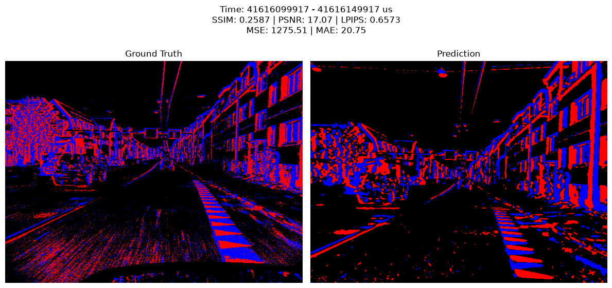
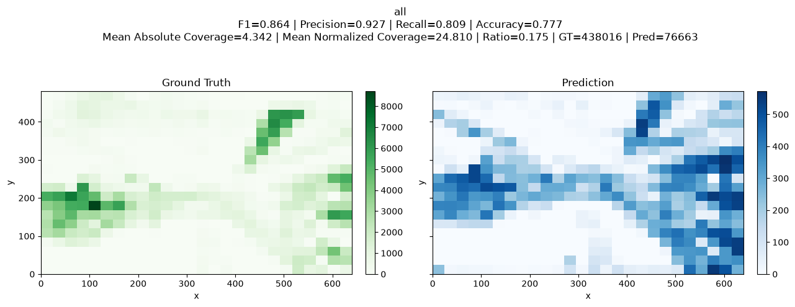
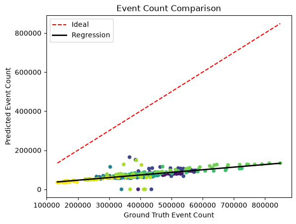
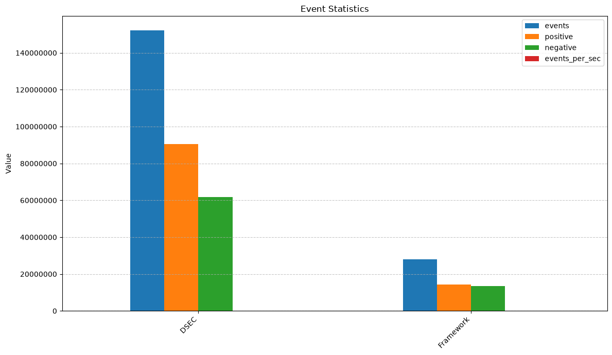
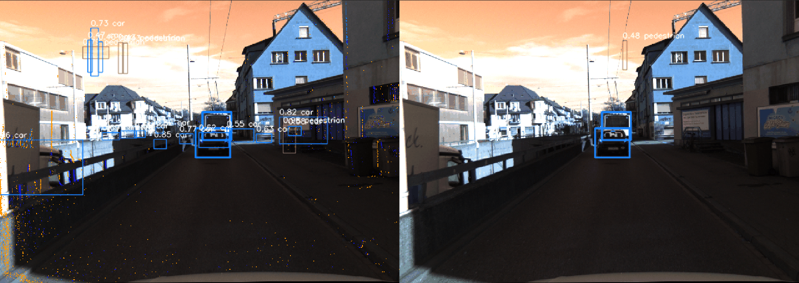

# Frame-to-Event Conversion Framework

**Author:** Zarco Romero, José Antonio  
**Repository:** https://github.com/jzarcoo/Frame-to-Event-Conversion-Framework.git

---

# 1. Background

Spiking Neural Networks (SNNs) perform best when processing sparse, asynchronous events generated by event cameras (DVS/DAVIS) rather than dense RGB images. However, event-camera datasets are limited, whereas conventional RGB video is abundant.

Converting RGB video into synthetic event streams enables existing RGB datasets to be used for training SNNs. The resulting models can then be deployed on real event cameras, allowing a single model to operate across both frame-based and event-based sensing modalities.

Public datasets such as DSEC and MVSEC provide synchronized RGB frames and real event recordings, enabling frame-to-event conversion methods to be directly validated against ground-truth events.

---

# 2. Project Objective

Develop a lightweight, classic framework (not based on deep learning) that converts RGB video into an event stream in the format `(x,y,t,p)`.

## Core Concept

Compare the current frame to the previous one at the pixel level and emit an event where the intensity change exceeds a configurable threshold:

- **ON. Positive polarity (`p = 1`)**: Increase in brightness.
- **OFF. Negative polarity (`p = -1`)**: Decrease in brightness.

---

# 3. Project Phases

## Phase 1: Literature Review

### ESIM

ESIM simulates event cameras by operating in the log-intensity domain, where an asynchronous event is triggered whenever the per-pixel brightness change exceeds a specified contrast threshold.

To accurately approximate this continuous level-crossing process without resorting to inefficient, fixed high-rate rendering, the framework tightly couples a 3D rendering engine with the event simulator. By evaluating the continuous camera trajectory and generating dense motion fields at each step, the system dynamically predicts the optimal timestamp for the next frame. This allows the simulator to sample heavily during rapid transient states and conserve computational resources when the scene is static.

This adaptive sampling is governed by two core mathematical strategies:

1. The first calculates the maximum expected rate of brightness change using a first-order Taylor expansion of the brightness constancy assumption.
2. A simplified alternative directly bounds the maximum pixel displacement.

To bridge the sim-to-real gap, ESIM incorporates physical sensor non-idealities. It models the contrast threshold as a Gaussian-distributed variable rather than a static value and supports independent, asymmetric thresholds for positive and negative events to faithfully replicate real-world hardware electronic biases.

The experiments in the article demonstrate that the adaptive method based on optical flow reduces simulation time and the number of frames needed to achieve the same level of accuracy (RMSE) as uniform sampling by up to 60%.

### v2e

v2e is a video-to-event conversion framework that generates synthetic DVS events directly from conventional RGB videos.

The pipeline first converts RGB frames into luma images and optionally increases their temporal resolution using Super-SloMo interpolation, producing intermediate frames that better approximate the continuous evolution of the scene.

The resulting intensities are then mapped to the logarithmic domain, since event cameras respond to relative brightness changes rather than absolute intensity values.

Events are generated whenever the accumulated change in log-intensity exceeds a positive or negative contrast threshold, closely mimicking the operation of a real DVS pixel.

To improve realism, v2e incorporates several sensor non-idealities:

- It models the finite bandwidth of photoreceptors through an intensity-dependent low-pass filter.
- It introduces pixel-to-pixel threshold variations using Gaussian-distributed contrast thresholds.
- It simulates hot pixels, leak events, and temporal shot noise through stochastic processes.

Unlike ESIM, which relies on a 3D rendering engine and adaptive rendering strategies, v2e operates directly on recorded video sequences, making it a practical and computationally efficient approach for converting existing image datasets into event-based data.

### Selected Approach

Based on this review, we chose a lightweight classical approach inspired by v2e.

Our goal is not to maximize physical realism, but to provide an efficient RGB-to-event conversion framework that captures the core behavior of event cameras while remaining computationally inexpensive and easy to apply to existing video datasets.

---

## Phase 2: Framework Implementation

- Programming Language: Python

Each RGB frame is converted to **grayscale** and transformed into the **logarithmic intensity domain**. A **Gaussian blur** is then applied to reduce noise.  The processed frame is compared with the last event frame, and pixels whose intensity change exceeds a predefined threshold are marked as events.

If enough pixels have changed, an event stream `(x, y, t, p)` is generated, where:

- `x` and `y` are the pixel coordinates.
- `t` is the timestamp.
- `p` is the polarity indicating whether the intensity increased or decreased.

The reference frame is updated with the detected changes, and the process repeats for the next frame.

The resulting events are rendered and saved as a video for visualization.

---

## Phase 3: Evaluation

To validate the effectiveness of our lightweight RGB-to-event framework, we evaluated the generated synthetic events against the DSEC dataset, which provides synchronized RGB frames and real event-camera recordings.

```bash
uv run python -m framework.evaluation.cli \
    -o zurich_city_13_a_summary \
    --gt data/dsec/test/zurich_city_13_a/events/left/events.h5 \
    --pred results/zurich_city_13_a_events.h5
```

Running the evaluation creates the directory `zurich_city_13_a_summary/`, which contains all outputs generated by the evaluation pipeline:

```text
zurich_city_13_a_summary/
├── analysis.json
├── frames/
│   ├── frame_0000_41616099917_41616149917.png
│   └── ...
└── histograms/
    ├── all/
    ├── on/
    └── off/
```

The evaluator processes the event streams in temporal windows of **50 ms** $(50,000 \mu s)$. For each window it generates:

- A reconstructed event frame comparing the DSEC ground truth and the generated events.
- Spatial histogram comparisons for ALL, ON, and OFF events.
- A JSON entry containing all quantitative metrics computed for that window.

The `analysis.json` file stores the evaluation results for every temporal window, including:

```text
start_us
end_us

images
    mse
    mae
    ssim
    psnr
    lpips

events
    all
    on
    off
```

For each event type (ALL, ON and OFF), the evaluator stores:

- Event counts (`gt_count`, `pred_count`, `event_ratio`)
- Occupied spatial cells (`occupied_gt`, `occupied_pred`)
- Confusion matrix statistics (`tp`, `fp`, `fn`, `tn`)
- Accuracy, Precision, Recall and F1-score
- Normalized coverage statistics
- Absolute coverage statistics

To analyze these results in more detail, see the [Jupyter notebook](../src/framework/analysis/Analysis.ipynb).

---

### 3.1 Frame Comparison

For every 50 ms window, the evaluator reconstructs event images from both the ground truth and the generated event stream.

- **ON** events correspond to pixels whose brightness increased.
- **OFF** events correspond to pixels whose brightness decreased.
- **ALL** events combine both polarities.

The reconstructed images are compared using several image-quality metrics.



The following metrics are computed for every reconstructed frame:

- **MSE (Mean Squared Error):** Average squared pixel-wise difference.
- **MAE (Mean Absolute Error):** Average absolute pixel-wise difference.
- **PSNR (Peak Signal-to-Noise Ratio):** Measures pixel-level fidelity. Higher values indicate lower distortion.
- **SSIM (Structural Similarity Index):** Measures structural similarity between reconstructed event images.
- **LPIPS (Learned Perceptual Image Patch Similarity):** Uses deep visual features (AlexNet) to estimate perceptual similarity. Since SNNs primarily rely on moving edges and structural information rather than exact pixel values, LPIPS provides a meaningful perceptual evaluation.

The average image-quality metrics over the 377 evaluation windows are summarized below.

| Metric | Mean | Best | Worst |
|:---------|----------:|---------:|----------:|
| MSE | 1246.3672 | 642.4761 | 1623.4905 |
| MAE | 20.1938 | 10.4382 | 25.5196 |
| PSNR | 17.2253 | 20.0522 | 16.0263 |
| SSIM | 0.2644 | 0.4685 | 0.1443 |
| LPIPS | 0.6511 | 0.5495 | 1.0414 |

Overall, the reconstructed event frames exhibit moderate structural similarity to the DSEC ground truth (mean SSIM = 0.2644). The average LPIPS of 0.6511 indicates noticeable perceptual differences between the generated and real event images, while the average PSNR of 17.23 dB and the corresponding MSE and MAE values show that the proposed lightweight framework preserves the main event structures but does not achieve pixel-level agreement with the event camera.

---

### 3.2 Spatial Histogram Evaluation

Besides comparing reconstructed images, the evaluator analyzes the spatial distribution of events.

For each temporal window, the image is divided into a regular grid. The number of events falling inside each grid cell is counted for both the ground truth and the generated event stream, producing two spatial histograms.

The histograms allow us to verify whether the generated events preserve the spatial structure of the scene, independently of the exact number of events.



From these histograms, the evaluator computes occupancy-based classification metrics.

| Mean Metric | ALL | ON | OFF |
|:--------------|-------:|-------:|-------:|
| ACCURACY | 0.7932 | 0.7094 | 0.7185 |
| PRECISION | 0.9356 | 0.8984 | 0.9304 |
| RECALL | 0.8093 | 0.7237 | 0.7205 |
| F1 | 0.8675 | 0.8006 | 0.8110 |

These metrics indicate that the generated events largely occur in the same spatial regions as the DSEC ground truth. Precision remains above 0.89 for all event types, indicating relatively few false positive occupied cells. Recall is slightly lower, especially for ON and OFF events, suggesting that some active regions present in the ground truth are not detected by the proposed framework. Overall, the F1-scores between 0.80 and 0.87 indicate good spatial agreement despite the reduced event density.

---

### 3.3 Coverage Metrics

In addition to occupancy, the evaluator measures how many events are generated inside each occupied grid cell.

Two complementary coverage measures are computed.

#### Absolute Coverage

Absolute coverage is defined as

$$
\frac{H_{pred}}{H_{gt}},
$$

where $H_{gt}$ and $H_{pred}$ denote the number of events inside each grid cell for the ground truth and prediction, respectively.

A value close to one indicates that a cell contains approximately the same number of events as the ground truth.

| Metric | ALL | ON | OFF |
|:-----------|--------:|--------:|--------:|
| mean_cov | 3.9254 | 3.2783 | 2.7765 |
| median_cov | 0.1717 | 0.1101 | 0.1491 |
| std_cov | 21.8852 | 16.9766 | 13.8802 |
| p25_cov | 0.0258 | 0.0056 | 0.0090 |
| p75_cov | 0.7505 | 0.5997 | 0.7131 |
| cov_gt_05 | 0.2990 | 0.2644 | 0.2943 |
| cov_gt_07 | 0.2506 | 0.2242 | 0.2441 |
| cov_gt_10 | 0.2100 | 0.1903 | 0.2023 |

The low median absolute coverage indicates that most occupied cells receive considerably fewer events than the corresponding DSEC cells. The much larger mean values are caused by a relatively small number of grid cells containing unusually high event concentrations, revealing a highly skewed spatial distribution.

#### Normalized Coverage

Since the generated event stream is significantly sparser than the DSEC ground truth, the evaluator also computes a normalized coverage by scaling the expected number of events according to the global event ratio:

$$
\frac{H_{pred}}{H_{gt}\cdot\frac{pred_{count}}{gt_{count}}}.
$$

This metric evaluates whether the generated events are distributed proportionally across the scene after compensating for the lower overall event count.

| Metric | ALL | ON | OFF |
|:-----------|---------:|---------:|--------:|
| mean_cov | 20.5825 | 19.9917 | 12.0820 |
| median_cov | 0.9059 | 0.6682 | 0.6415 |
| std_cov | 115.4358 | 104.2285 | 60.9271 |
| p25_cov | 0.1365 | 0.0329 | 0.0353 |
| p75_cov | 3.9469 | 3.6196 | 3.0958 |
| cov_gt_05 | 0.6024 | 0.5352 | 0.5329 |
| cov_gt_07 | 0.5458 | 0.4878 | 0.4849 |
| cov_gt_10 | 0.4761 | 0.4318 | 0.4256 |

After compensating for the lower global event count, the median normalized coverage approaches one (0.91 for ALL events). This indicates that, although the framework generates substantially fewer events overall, the available events are distributed across the scene in a manner that closely follows the spatial activity observed in the DSEC ground truth. The high mean values are again influenced by a relatively small number of grid cells with exceptionally high event concentrations, whereas the median provides a more representative description of the typical spatial agreement.

---

### 3.4 Quantitative Results

Running the evaluator over the sequence produced the following summary:

```text
Grid size for coverage evaluation: 24
Running in frame-by-frame mode (Interval: 50000 us)
Frames: 377/377 (100.00%) [41634949917-41634999917 us]
Analysis saved to zurich_city_13_a_summary/analysis.json
Valid evaluations : 377
Skipped           : 0
```

Across the 377 evaluation windows, the total number of generated events showed a **Pearson correlation coefficient of 0.709** with the DSEC ground truth. This indicates a moderately strong positive relationship between both event streams: temporal windows containing more real events generally also produce more synthetic events.

To further analyze this relationship, the number of generated events was plotted against the number of ground-truth events for every evaluation window. The red dashed line corresponds to the ideal case ($y=x$), while the black line represents the least-squares linear regression:

$$
\text{Predicted Events}=0.1337\times\text{Ground Truth Events}+19\,940.
$$

The regression slope of 0.1337 indicates that every additional 100 ground-truth events correspond, on average, to approximately 13 generated events. Although the generated event stream is considerably sparser than the DSEC ground truth, the positive regression slope and Pearson correlation demonstrate that the proposed framework successfully follows the temporal variations of scene activity.



---

### 3.5 Event Sparsity Analysis

A critical finding from the evaluation is the overall event yield. The generated synthetic event stream contains only **18.29%** of the events recorded by the DSEC event camera.



As shown above, the DSEC sequence contains more than **140 million** events, whereas the proposed framework generates approximately **20 million** events. Despite this large reduction in event count, the previous analyses demonstrate that the generated events preserve much of the spatial organization of the scene and maintain a clear correlation with the temporal dynamics observed in the ground-truth event stream.

### 3.6 Object Detection Evaluation

Although the previous sections evaluate the similarity between the generated and real event streams, the ultimate goal of an event representation is to support downstream vision tasks. Therefore, we also evaluated whether the generated events can be directly used by an event-based object detector.

Instead of training a new detector, we evaluated our generated event stream using an existing Spiking Neural Network (SNN) detector trained on the DSEC-Detection dataset.

> **Credits**
>
> This experiment uses the following open-source projects:
>
> - **TWL Spike YOLO** (KirillHit): https://github.com/KirillHit/twl_spike_yolo
> - **DSEC-Detection utilities** (UZH RPG): https://github.com/uzh-rpg/dsec-det
> - **DSEC Dataset**: https://dsec.ifi.uzh.ch/

The evaluation was intentionally performed without retraining or fine-tuning the detector. The objective was to determine whether the synthetic event stream produced by our framework can be used as a direct replacement for the original DSEC event camera recordings.

The DSEC-Detection dataset stores the event stream in

```text
sequence/
├── events/
│   ├── left/
│   │   └── ...
│   │   └── events.h5
│   └── right/
├── images/
├── object_detections/
└── calibration/
```

For our experiment, we simply replaced `events/left/events.h5` with the synthetic event file generated by our framework, while leaving all RGB images, calibration files, timestamps, and object annotations unchanged. 

Consequently, the detector processed exactly the same driving sequence under identical conditions, with the only difference being the source of the event stream.

The pretrained model was evaluated using

```bash
python main.py test --config config/yolo8l_dsec_only_events.yaml
```

#### Detection Performance

Two experiments were performed:

1. Original DSEC event stream
2. Synthetic event stream generated by our framework

The evaluation metrics are summarized below.

| Metric | DSEC Events | Generated Events |
|---------|------------:|-----------------:|
| mAP | **0.1868** | **0.0000** |
| mAP@50 | **0.3785** | **0.0000** |
| mAR@1 | **0.1566** | **0.0000** |
| mAR@10 | **0.3227** | **0.0000** |
| mAR@100 | **0.3231** | **0.0000** |
| Test Loss | **0.0382** | **0.1446** |

The pretrained detector achieves a reasonable detection performance when evaluated on the original DSEC event stream. However, replacing the original events with the synthetic events generated by our framework reduces all detection metrics to zero.

This result is expected because the detector was trained exclusively on real event-camera data. Although the proposed framework preserves part of the temporal and spatial structure of the scene, the generated event stream follows a different distribution than the one learned by the network during training.

#### Qualitative Results

To better understand this behavior, we also performed inference using the pretrained detector and compared the predicted bounding boxes.

```bash
python main.py predict --config config/yolo8l_dsec_only_events.yaml
```

The left image shows detections obtained from the original DSEC events, while the right image shows detections obtained after replacing the event stream with the one generated by our framework.



The detector successfully identifies several vehicles and pedestrians when using the original DSEC event stream. In contrast, when using the generated events, only a small number of detections remain.

---

## Phase 4: Discussion

This project demonstrates that a lightweight, classical frame-to-event conversion algorithm can generate synthetic event streams that preserve much of the spatial and temporal structure observed in real event-camera recordings, while remaining computationally simple and efficient.

Unlike simulators such as v2e, the proposed framework intentionally avoids computationally expensive components such as sub-frame interpolation, sensor noise simulation, and camera-specific physical modeling. Instead, it relies on frame differencing between consecutive RGB images to generate ON and OFF events.

The quantitative evaluation against the DSEC dataset shows that the generated event streams retain a strong correspondence with the real data. Across 377 temporal windows, the generated event counts achieved a Pearson correlation coefficient of 0.709 with the ground-truth event stream, indicating that periods of high scene activity generally produce more synthetic events as well.

Although pixel-wise metrics such as MSE and SSIM reveal noticeable differences between reconstructed frames, visual inspection confirms that the generated events successfully capture the dominant scene boundaries, moving vehicles, buildings, and other large structures that define the event representation.

The spatial histogram analysis leads to a similar conclusion. The framework achieves high precision and F1-score across ALL, ON, and OFF event polarities, demonstrating that generated events tend to appear in the correct spatial regions even though the exact event counts differ from those recorded by the event camera. The coverage metrics also show that, after compensating for the lower event density, the spatial distribution of events remains reasonably consistent with the DSEC ground truth.

One of the most significant characteristics of the proposed framework is the substantial reduction in generated events. The synthetic event stream contains only $18.29 \%$ of the events recorded by the DSEC camera. This reduction is a direct consequence of the frame-differencing strategy. Real Dynamic Vision Sensors operate asynchronously at microsecond resolution and naturally produce additional events due to sensor noise, background activity, contrast threshold variability, and hardware effects. Since the proposed method generates events only from observable intensity differences between consecutive RGB frames, these additional sensor-specific events are not reproduced.

This reduction should therefore not necessarily be interpreted as a limitation. Instead, the generated event stream represents a cleaner and more compact approximation of the scene dynamics, removing much of the background activity while preserving the principal moving structures.

To further evaluate the usefulness of the generated events, we tested them using a pretrained event-based object detector based on a Spiking Neural Network. The detector achieved reasonable performance on the original DSEC event stream but failed to detect objects when the original events were replaced with the synthetic events generated by our framework.

This result highlights an important distinction between structural similarity and domain compatibility. Although the proposed framework preserves many of the visual characteristics of real event data, the statistical distribution of the generated events differs from that of a physical event camera. Existing deep learning models trained exclusively on real event streams therefore do not generalize directly to the generated representation.

Overall, the proposed framework should be viewed as a lightweight event generation method rather than a physically accurate event camera simulator. Its primary contribution is providing an efficient way to convert conventional RGB datasets into event representations that preserve the essential temporal and spatial information required for analysis, visualization, and future neuromorphic research.

Future work includes incorporating more realistic event camera models, such as adaptive contrast thresholds, temporal interpolation, and sensor noise simulation, as well as investigating domain adaptation or fine-tuning strategies that allow event-based neural networks to better exploit synthetic event streams generated from RGB data.

---

# 4. Additional Notes

## 4.1 CLI Usage

The framework provides a robust command-line interface for processing and evaluation, supporting multiple modes to analyze temporal accuracy:

* Evaluate a specific time window:
```bash
uv run python -m framework.evaluation.cli -o timewindow --gt data/dsec/test/zurich_city_13_a/events/left/events.h5 --pred results/zurich_city_13_a_events.h5 --timewindow 49599800165 49599900165
```

* Evaluate using a text file of predefined windows:
```bash    
uv run python -m framework.evaluation.cli -o window_queries --gt data/dsec/test/zurich_city_13_a/events/left/events.h5 --pred results/zurich_city_13_a_events.h5 --windows window_queries.txt
```

* Evaluate specific temporal clips in seconds:
```bash 
uv run python -m framework.evaluation.cli -o clip --gt data/dsec/test/zurich_city_13_a/events/left/events.h5 --pred results/zurich_city_13_a_events.h5 --seconds 1 5
```

## 4.2 Third-Party Utilities

The framework reuses a small number of well-established utilities for interoperability with external datasets and evaluation pipelines.

* **DSEC EventSlicer**  
  The `EventSlicer` implementation (`src/framework/utils/dsec/eventslicer.py`) is adapted from the official DSEC repository and is used to efficiently retrieve temporal event windows from HDF5 event files during preprocessing and evaluation.  
  **Source:** https://github.com/uzh-rpg/DSEC/blob/main/scripts/utils/eventslicer.py

<!-- * **Prophesee DAT Event Tools**  
  The official Prophesee event serialization utilities (`src/framework/utils/prophesee/dat_events_tools.py`) are used by `src/framework/utils/sfod_converter.py` to export generated HDF5 event streams to the `.dat` format required by the Spiking Fusion Object Detector (SFOD) compatibility experiments. These utilities are used exclusively for format compatibility and are not part of the proposed frame-to-event conversion algorithm.  
  **Source:** https://github.com/yimeng-fan/SFOD/blob/main/prophesee_utils/io/dat_events_tools.py -->


# References

* Delbruck, T., Hu, Y., & Liu, S. (2021). *v2e: From Video Frames to Realistic DVS Events*. Institute of Neuroinformatics, University of Zürich and ETH Zürich, Switzerland. 

* Gehrig, M., Aarents, W., Gehrig, D., & Scaramuzza, D. (2021). DSEC: A stereo event camera dataset for driving scenarios. IEEE Robotics and Automation Letters. https://doi.org/10.1109/LRA.2021.3068942

* Gehrig, D., Rebecq, H., & Scaramuzza, D. (2018). *ESIM: an Open Event Camera Simulator*. Robotics and Perception Group, Depts. Informatics and Neuroinformatics, University of Zurich and ETH Zurich. https://rpg.ifi.uzh.ch/docs/CORL18_Rebecq.pdf

* Gehrig, D., & Scaramuzza, D. (2024). Low latency automotive vision with event cameras. Nature.

* Khitushkin, K.S., Isakov, T.T., Bakhshiev, A.V. (2026). Using Spiking Neural Networks for Event and Multimodal Data Processing in Object Detection Tasks. In: Kryzhanovsky, B., Dunin-Barkowski, W., Redko, V., Tiumentsev, Y., Klimov, V.V. (eds) Advances in Neural Computation, Machine Learning, and Cognitive Research IX. NEUROINFORMATICS 2025. Studies in Computational Intelligence, vol 1241. Springer, Cham. https://doi.org/10.1007/978-3-032-07690-8_10

* Y. Hu, S-C. Liu, and T. Delbruck. v2e: From Video Frames to Realistic DVS Events. In 2021 IEEE/CVF Conference on Computer Vision and Pattern Recognition Workshops (CVPRW), URL: https://arxiv.org/abs/2006.07722, 2021